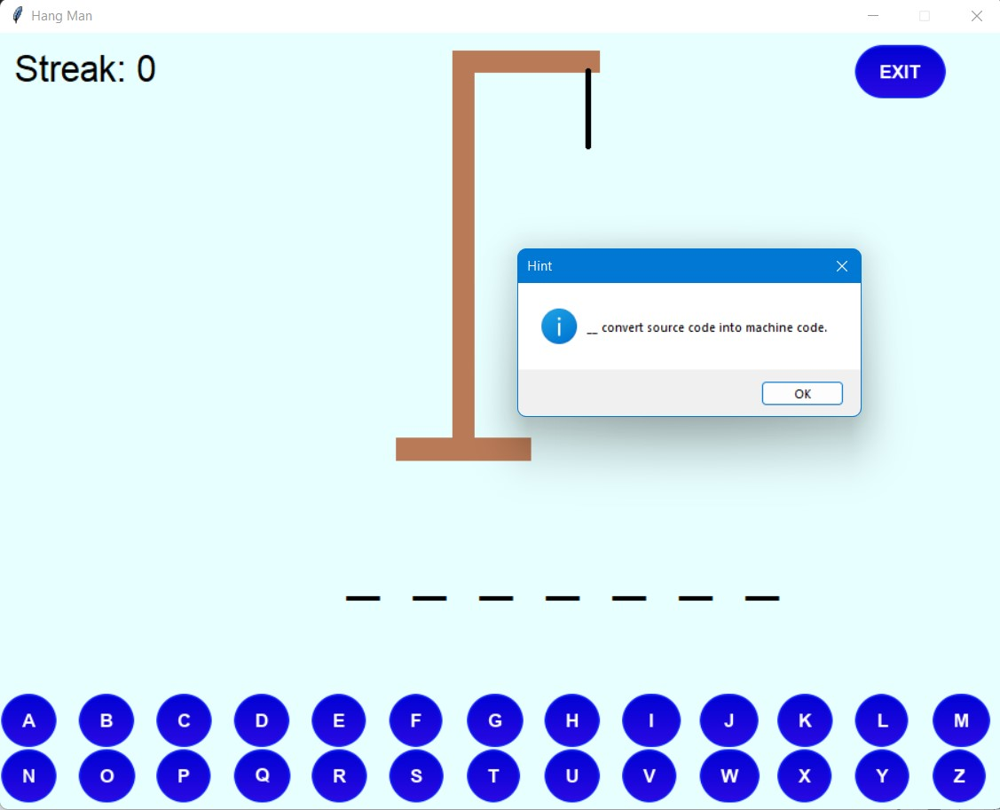

# Project Title

Game Deck!!! is a desktop application to play all your favourite retro games using a single userid & password.

The motivation behind this project was the common frustration of installing all indivadual games that you love to play and creating seperated account for each game to keep track of your scores. And we all *hate* to do that.

Hence the solution to this was to create a application which combines all your games in one app and also be able to keep track of your scores all using a single userid & password.

## Game List

The games included are some of my favourites and the ones which i have played growing up & am sure most people of my age have as well. Hope you like them ☺

    1. Snake Game
    2. Quiz Game
    3. Pong Game
    4. Turtle Crossing Game
    5. Hangman

`*All the games included are single player games except Pong game.`

## Screenshots

✨ Let's take a glimpse of the project ✨

#### Game Deck!!

https://user-images.githubusercontent.com/71484962/190631302-43cc3867-6ad9-495e-909c-4aa8c460c10d.mp4

#### Login Page

#### SignUp Page

#### Main Page

#### Instructions Page

#### Profile Page

## GamePlay images

#### Snake Game

#### Quiz Game

#### Pong Game

#### Turtle Crossing Game

#### Hangman Game

 

## Setup & Installation

If you're using git, clone the project to your local machine by running this command 👇

`git clone https://github.com/PritKalariya/Game-Deck.git`

` 🤝 Else you can click on the ***<>Code*** button and download the project folder in zip format.`

To run this project.

1. Install the necessary modules required to run this project using the following command 👇

    `$ pip install -r requirements.txt`

2. Change your working directory to project directory using the command 👇

    `$ cd Game-Deck`

3. Execute the *game_deck.py* file using the command 👇

    `$ python game_deck.py`

4. Voilà enjoy playing Game Deck!!

## Contributers

1. [Prit Kalariya](https://github.com/PritKalariya)
2. [Yashraj Metkar](https://github.com/metkar25)

We hope you liked this project 😊 
Feel free to reach out to us via email on <kalariyaprit2000@gmail.com> to share your feedbacks & suggestions 💙
